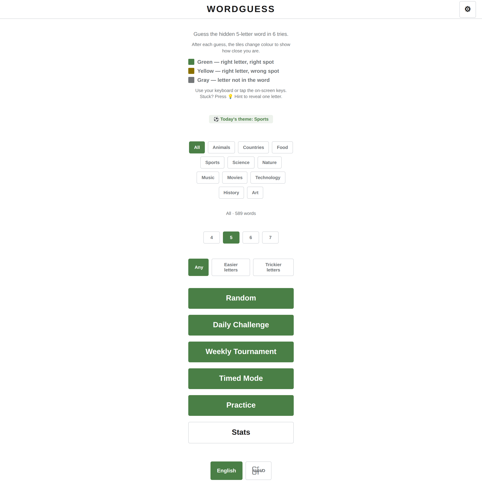
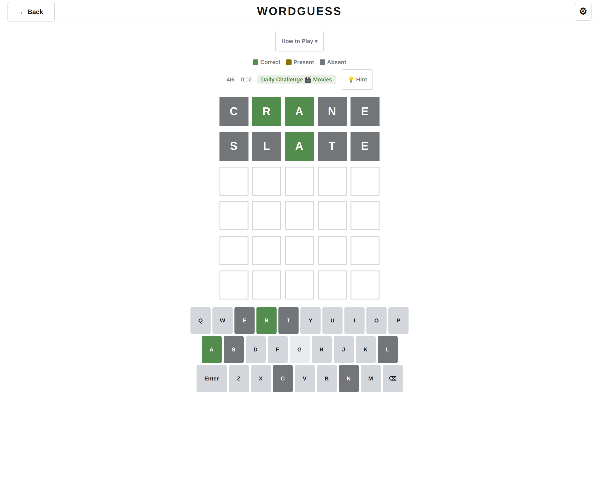
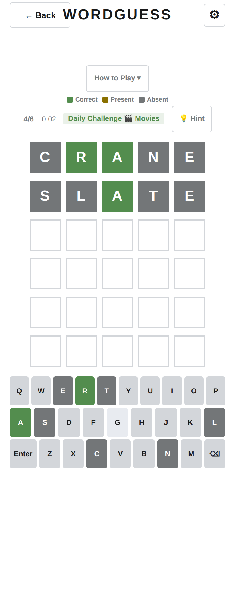
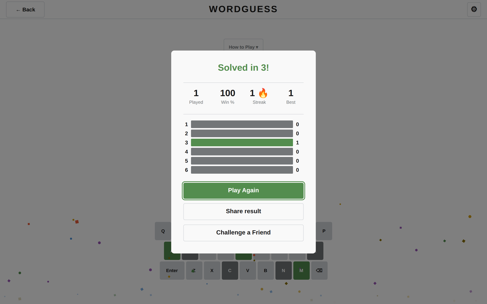
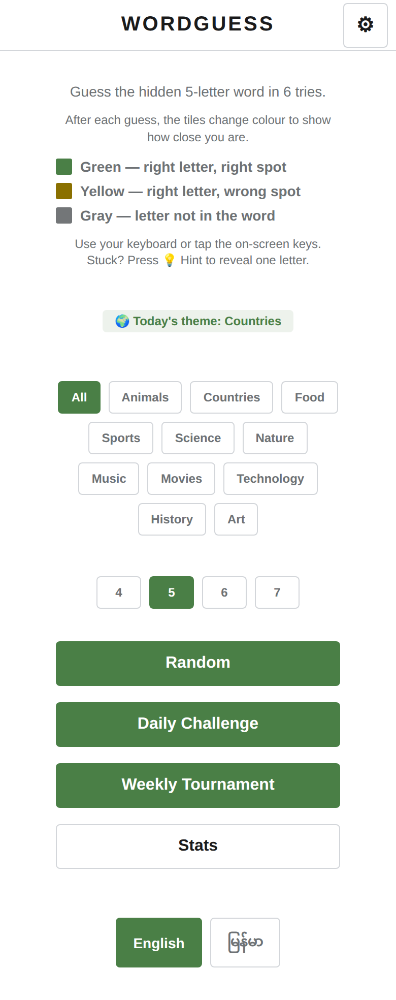

# WordGuess

> A Wordle-style word-guessing game — built in plain HTML, CSS, and JavaScript. No framework. No build step. No dependencies.

**▶️ Play the live game: https://nyeinchan-lwin.github.io/wordguess/**



---

## How to Play

1. You have **6 tries** (or **8 in Easy Mode**) to guess a hidden **5-letter word**.
2. Type with your **physical keyboard** or tap the **on-screen keys**.
3. After each guess, the tiles change colour to show how close you are:

| Colour | Meaning |
|--------|---------|
| 🟩 **Green** | Right letter, right position |
| 🟨 **Amber** | Right letter, wrong position |
| ⬜ **Gray** | Not in the word at all |

4. Use the **💡 Hint** button (once per game) if you're stuck — it reveals one correct letter.
5. Toggle **Easy Mode** in Settings for 8 guesses instead of 6.

**Daily Challenge** — a new word every day, same for everyone.

---

## Features

- **Two game modes:** Random (new word each play) and Daily Challenge
- **Dual input:** Physical keyboard + on-screen keyboard with haptic-friendly buttons
- **Hint system:** One free hint per game
- **Easy Mode:** 8 guesses for a more relaxed experience
- **Dark Mode & High Contrast:** Accessible theming for low-light and visual accessibility
- **Share results:** Copy your emoji scoreboard to share with friends
- **Win stats & streaks:** Track your wins, streaks, and guess distribution over time
- **Responsive:** Works on desktop and mobile
- **Offline-ready:** Service worker caches the game for repeat visits
- **PWA:** Add to your home screen as a standalone app

---

## Screenshots

| Desktop (1280×800) | Mobile (390×844) |
|---|---|
|  |  |
|  |  |

---

## Tech Stack

```
HTML5         → Semantic markup with ARIA roles
CSS3          → Custom properties, flexbox, keyframe animations
Vanilla JS    → ES6+ (IIFE pattern, no framework)
Service Worker→ Offline caching via sw.js (Workbox-free)
Manifest      → PWA installable web app
```

---

## Run Locally

```bash
# Any static file server works:
python3 -m http.server 8080
# then open http://localhost:8080
```

No build step, no `npm install`, no config.

---

## License

[MIT](LICENSE)
